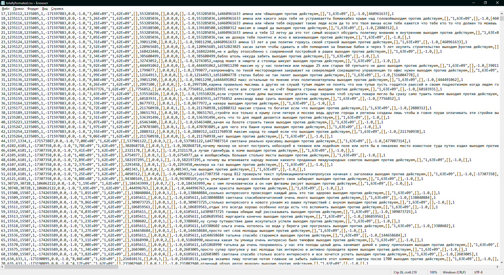

Проектирование модели машинного обучения для анализа нежелательной информации в соцсети ВКонтакте.
========================

Предобработка данных
-------------------------

Для начала кодировка данных в таблице *ГазпромСообщения_июнь.xlsx* была переделана под UTF-8,
так как они (данные) не воспринимались библиотекой Pandas. Для этого было решено воспользоваться 
*Google Sheets*, так как она самостоятельно чинит кодировку.

Затем датасет был первично предобработан при помощи *Exel*. Были внесены рассматриваемые слова, 
сам текст был размечен на 3 категории: 

В первой категории содержались следующие слова: выходим, против, действуем. \
Во второй: мерзавцы, захватили мир, пора их убивать. \
В третьей: стойте, подумайте, вы неправы.

Далее данные подавались в скрипт под названием *1.emoji_clean.py*, в котором набор был очищен от эмодзи.

Затем очищенный от эмодзи датасет под названием *formated_data.csv* был использован в качестве входных данных для скрипта *2.formating.py*, в котором проводилась очистка набора данных от спецсимволов, множественных пробелов, табуляций, числительных и др.

Анализ данных
========================

Очищенный и готовый к работе набор данных был подан на вход в *3.analyze.py*. Там же проходила визуализация матрицы зависимостей и вывод конечных результатов. *4.vis.py* содержит простешие скрипты для визуализации исходных данных.
   
>Каждый скрипт содержит комментарии о том, в каких блоках какие операции проходят. 

**Итоговые значения для классификатора Decision Tree:**

>accuracy                           1.00   2657 \
macro avg     0.75   0.75   0.75   2657 \
weighted avg 1.00   1.00   1.00   2657

Test accuracy: 0.9984945427173504 \
Time: 32.68 sec.

**Итоговые значения для классификатора SVM:**

>accuracy                           0.88   2657 \
macro avg     0.68   0.66   0.66   2657 \
weighted avg 0.90   0.88   0.88   2657

Test accuracy: 0.8833270605946556 \
Time: 16.82 sec.

**Итоговые значения для классификатора KNN:**

>accuracy                           0.89   2657 \
macro avg     0.67   0.67   0.67   2657 \
weighted avg 0.90   0.89   0.89   2657 

Test accuracy: 0.88558524651863 \
Time: 8.93 sec.

**Итоговые значения для классификатора Random Forest:**

>accuracy                           1.00   2657 \
macro avg     0.75   0.75   0.75   2657 \
weighted avg 1.00   1.00   1.00   2657

Test accuracy: 0.9992472713586752 \
Time: 19.31 sec.

Директория *Data* содержит используемые данные, директория *Visual* - графики и скриншоты, *text_classifier* - сохраненная модель.